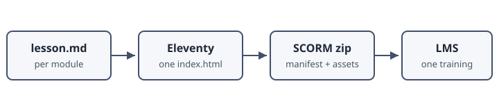

## From Markdown to SCORM



Everything a learner sees in this course started as the markdown file you are reading the rendered form of right now. The pipeline has three stages:

1. **Author** — write `lesson.md` per module, with YAML frontmatter and plain markdown.
2. **Build** — Eleventy renders every lesson body into one `index.html`, wraps it with a SCORM 1.2 manifest, and zips the result.
3. **Validate** — a package validator checks the zip against the single-page SCO contract before it goes anywhere near an LMS.



The whole course is a single HTML file. Each page you navigate to is cloned out of an inert `<template>` element by a small JavaScript runtime, so the SCORM session initializes exactly once - the key to reliable completion tracking.



## Authoring Building Blocks

Pages are separated with a `nextPage` marker in the markdown source. Within a page you use ordinary markdown: headings, lists, tables, images, and code fences.

Three shortcode families add interactivity:

- **Callouts** - `tip`, `info`, and `warning` render as styled asides.
- **Objectives** - the block at the top of this module was generated from the frontmatter's `learning_objectives` list.
- **Knowledge checks** - inline quizzes with per-option feedback, like the one below.


Edit this file, save, and the lint-on-save hook checks the structure before you ever run a build.



question: "Why does this pipeline render the entire course into a single HTML file?"
options:
  - text: "It makes the zip file smaller"
    correct: false
    feedback: "Size is roughly the same either way. The reason is completion tracking."
  - text: "So the SCORM session initializes exactly once per launch"
    correct: true
    feedback: "Correct. Multi-page SCOs re-initialize on every navigation, which breaks progress tracking on some LMS platforms."
  - text: "Because SCORM 1.2 only allows one HTML file"
    correct: false
    feedback: "SCORM 1.2 allows many files. The single-page design is a deliberate compatibility choice."




## Lint, Build, Validate

Three commands take a course from source to an upload-ready package:

```bash
python3 scripts/lint-lessons.py sample-course
scripts/build-scorm.sh sample-course
python3 scripts/validate-scorm.py courses/sample-course/scorm/dist/sample-course.zip
```

The linter blocks the build on structural errors: broken image paths, empty pages, knowledge checks with no correct answer. The validator blocks the upload on packaging errors: a nested zip root, a missing mastery score, stale multi-page artifacts.

### Summary

- Lessons are plain markdown plus a small shortcode vocabulary
- The build produces one single-page SCORM 1.2 zip per course
- Lint before building; validate before uploading

You have reached the end of the example module. Once every page has been visited, the course records itself as complete with the LMS automatically.


