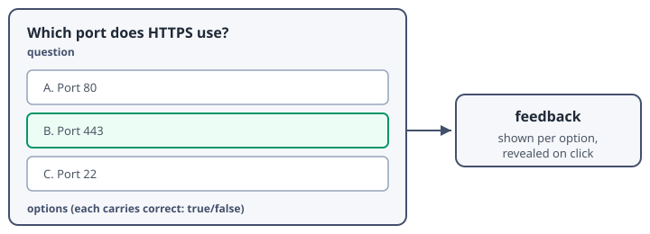

## Knowledge Checks



A knowledge check is an inline quiz question embedded directly in a lesson page. In the markdown source it is a `knowledgeCheck` shortcode block containing a YAML payload: one `question`, a list of `options`, and for each option a `text`, a `correct` flag, and a `feedback` string that the learner sees after clicking that option.

Two design rules shape how checks behave at runtime:

1. **Immediate feedback.** Clicking any option reveals that option's feedback right away. A wrong answer explains *why* it is wrong and lets the learner try again; a correct answer locks the question.
2. **At least one correct option.** The lesson linter refuses to build a course containing a check where every option is `correct: false`, because such a question could never be answered and would trap the learner on the page.



## Ungraded Checks and Retry Behavior

By default a knowledge check is **ungraded**: it exists for practice and reinforcement, and it never contributes to the SCORM score reported to the LMS. Wrong answers keep the options enabled so the learner can reason through the feedback and try again.

Try the check below. Pick a wrong answer first and read the feedback, then pick the right one.


question: "A learner clicks a **wrong** option on an ungraded knowledge check. What happens next?"
options:
  - text: "The page locks and the learner must restart the module"
    correct: false
    feedback: "Nothing is locked on a wrong answer. The check shows feedback and stays open for another try."
  - text: "The feedback for that option appears and the learner can try again"
    correct: true
    feedback: "Correct. Wrong answers show their explanation and leave the options enabled for retry."
  - text: "The LMS records a failing score"
    correct: false
    feedback: "Ungraded checks never touch the SCORM score. They are practice, not assessment."


Knowledge checks also participate in page gating: the Next button stays disabled until every check on the current page has been answered correctly (and the page's minimum dwell time has elapsed). That is why a check belongs right after the concept it reinforces - the learner cannot skim past it.



## Graded Checks

Adding `graded: true` to the YAML payload marks a check as **graded**. A graded check behaves the same way on screen, but the moment it is answered correctly the runtime commits the learner's progress to the LMS, so the answered state survives even if the session ends right afterwards.

Use graded checks sparingly - one at the end of a module is usually enough. The check below is graded; answer it to unlock the end of this module.


graded: true
question: "Which statements about graded knowledge checks are true? (There is more than one defensible answer - any one of them completes this check.)"
options:
  - text: "A correct answer commits progress to the LMS immediately"
    correct: true
    feedback: "Correct. Graded checks trigger an immediate commit so the answered state is durable."
  - text: "They replace the course completion rules"
    correct: false
    feedback: "No. Completion still requires visiting every page; graded checks only add a durable commit."
  - text: "On screen they look and behave like ungraded checks"
    correct: true
    feedback: "Correct. The learner-facing interaction is identical; only the commit behavior differs."


### Summary

- A knowledge check is YAML inside a shortcode: question, options, per-option feedback
- Ungraded checks are for practice; wrong answers allow retry and never affect the score
- Graded checks commit progress to the LMS as soon as they are answered correctly
- Every check on a page must be answered correctly before Next unlocks


