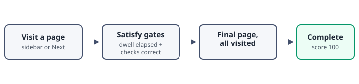

## Embedding Media



Every image a lesson embeds lives in the module's own `visuals/` directory and is referenced with ordinary markdown:

```markdown

```

At build time the pipeline copies each module's `visuals/` directory into the package's `assets/images/<module-id>/` folder and rewrites the image paths to match, so the same relative path works in your editor's preview and in the packaged course. The linter checks every referenced image actually exists before the build starts - a typo in a path fails the lint step, not the learner.

Supported formats are the standard web set: SVG, PNG, JPEG, GIF, and WebP. Prefer SVG for diagrams (it stays crisp at any zoom) and PNG or JPEG for screenshots. The diagram below is an SVG embedded exactly this way:






## Dwell Time

The Next button on each page stays disabled until a minimum **dwell time** has elapsed. The course-wide default comes from `course.yaml` (`min_page_dwell_seconds`), and any page can override it with the `dwell` shortcode:

```markdown

```

This very page carries that override, so its Next button unlocks immediately instead of waiting out the course-wide default of five seconds. `dwell 0` removes the gate entirely, which is handy for a short page like this one.


The first page of each module is exempt from gating entirely - learners land on module intros without a countdown, which keeps navigation between modules fluid.



Dwell time is a nudge, not a proctor. Set it to roughly the time an attentive reader needs, and keep overrides rare - a course full of custom timers is a sign the pages are unevenly sized.



question: "A page has no `dwell` override and no knowledge checks. When does its Next button unlock?"
options:
  - text: "Immediately, because the page has nothing to gate on"
    correct: false
    feedback: "The course-wide default from course.yaml still applies unless a page opts out with `dwell 0`."
  - text: "After the course-wide `min_page_dwell_seconds` elapses"
    correct: true
    feedback: "Correct. Without an override, every non-intro page uses the course-wide default."
  - text: "Never - every page needs at least one knowledge check to unlock Next"
    correct: false
    feedback: "Knowledge checks are optional. A page with none only needs its dwell time to elapse."




## How Completion Is Decided

The course reports completion to the LMS automatically. Three rules combine to decide when:

| Rule | What it requires |
| --- | --- |
| Visit every page | Each page's gates (dwell + knowledge checks) satisfied once |
| Reach the final page | The learner is on the course's last page |
| Mastery score | The runtime reports score 100, matching the manifest's mastery score |

Until all pages are visited, the course stays `incomplete`, and leaving mid-course suspends the attempt so the learner resumes where they left off. When the final page's gates are satisfied and no page remains unvisited, the runtime marks the attempt complete, records the score, and commits - no Finish button required.

### Summary

- Images live in `visuals/` per module and are referenced with plain markdown paths
- The linter verifies image paths; the build rewrites them into the package
- Dwell time gates each page, with a per-page `dwell` override available
- Completion is automatic: visit every page, satisfy every gate, and the course records itself complete

You have reached the end of the course. Once this page's dwell elapses, your completion is recorded with the LMS automatically.


